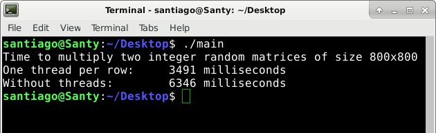

# Multithreaded Matrix Multiplier

A program that compares two methods of matrix multiplication.
It generates linearly at random two 800x800 matrices of integer numbers.
It shows the execution times in milliseconds for calculating the generated matrices multiplication of two distinct approaches: a multithreading and the sequentially.
The multithreading method creates one thread responsible for calculating each row of the resultant matrix.
Therefore, 800 threads fill in parallel all matrix rows.

- __Platforms__: Linux and Windows __(not tested)__
- __Used libraries__: Boost.Chrono (1.62.0) and thread
- __Programming language__: C++
- __Last code change__: 11/01/2019
